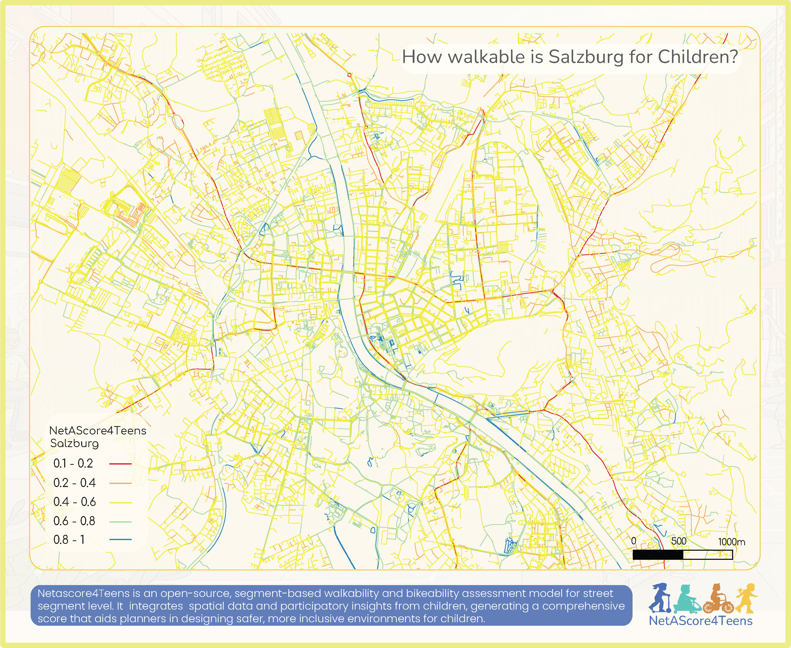

# NetAScore4Teens
**Streets for Young People**: An interactive dashboard showing how walkable and bikeable streets are for teenagers, in Salzburg (Austria) and Olomouc (Czechia). The dashboard visualises results produced by the [NetAScore for Children](https://github.com/urbanistamna/netascore_children) pipeline; a modified version of the [NetAScore](https://github.com/plus-mobilitylab/netascore) walkability/bikeability indicator tool, adapted to reflect how teenagers and children experience street networks.

# Data Sources

- **Network indicators & scoring**: [urbanistamna/netascore_children](https://github.com/urbanistamna/netascore_children)
- **Base network model**: [plus-mobilitylab/netascore](https://github.com/plus-mobilitylab/netascore)
- **Land use / land cover & street tree layers**: Copernicus Urban Atlas Data & Open Street Map POIs.
- **Base Map, Road Network**: Open Street Map

## Tech Stack

- [MapLibre GL JS](https://maplibre.org/) for vector tile rendering
- [PMTiles](https://github.com/protomaps/PMTiles) for serving map tiles without a tile server
- [Chart.js](https://www.chartjs.org/) for score breakdown charts
- Vanilla HTML/CSS/JS 

## Credits

The is the original work of **Amna Azeem** © 2026, submitted in partial fulfilment of the requirements for the Copernicus Master in Digital Earth at Paris Lodron University Salzburg and Palacký University Olomouc.

- [Copernicus / MASTER CDE](https://master-cde.eu/)
- [Co-funded by the European Union](https://european-union.europa.eu/)
- [Paris Lodron University Salzburg (PLUS)](https://www.plus.ac.at/)
- [Palacký University Olomouc (UP)](https://www.upol.cz)
- [Mobility Lab](https://mobilitylab.zgis.at/en/home-2/) University of Salzburg (PLUS)
- [i-mobyl](https://https://www.i-mobyl.eu/)

**Connect:**
[LinkedIn](https://www.linkedin.com/in/amna-azeem/) · [GitHub](https://github.com/urbanistamna) · [Instagram](https://www.instagram.com/urbanistamna) · [X / Twitter](https://x.com/urbanistamna)
